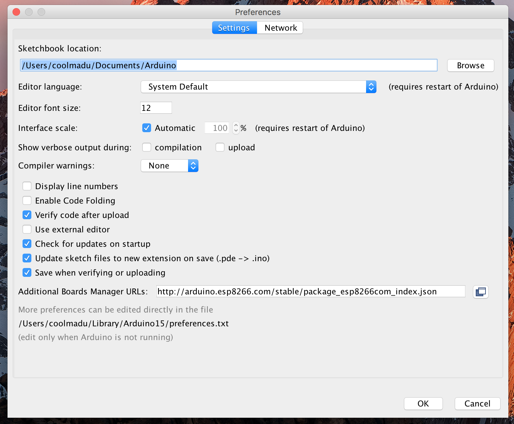
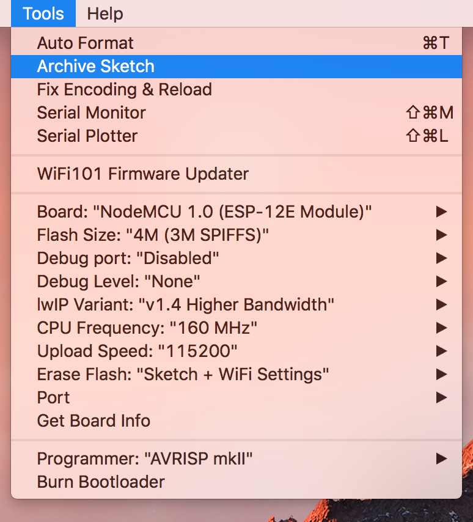

# esp8266 WiFi TCP/IP Server

### Installing with Boards Manager

Starting with 1.8.1, Arduino allows installation of third-party platform packages using Boards Manager. We have packages available for Windows, Mac OS, and Linux (32 and 64 bit).

- Install the current upstream Arduino IDE at the 1.8 level or later. The current version is at the [Arduino website](http://www.arduino.cc/en/main/software).
- Start Arduino and open Preferences window.
- Enter ```http://arduino.esp8266.com/stable/package_esp8266com_index.json``` into *Additional Board Manager URLs* field. You can add multiple URLs, separating them with commas.
- Open Boards Manager from Tools > Board menu and install *esp8266* platform (and don't forget to select your ESP8266 board from Tools > Board menu after installation).

Documentation: [https://arduino-esp8266.readthedocs.io/en/2.4.1/](https://arduino-esp8266.readthedocs.io/en/2.4.1/)



### Arduino IDE settings for esp8266 module


